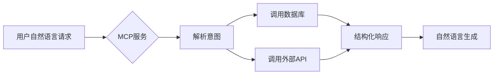

## 一、MCP核心价值

### 1.1 核心功能
- 🛡️ **安全网关**：为LLM访问业务系统提供鉴权层
- 🔄 **协议转换**：将自然语言查询转换为结构化API调用
- 📊 **上下文管理**：维护跨会话的对话上下文状态
- ⚙️ **工具编排**：组合多个API调用实现复杂操作

### 1.2 典型应用场景


## 二、服务端开发实战

### 2.1 初始化项目
```bash
mkdir mcp-demo
cd mcp-demo
npm init -y
npm install @modelcontextprotocol/sdk typescript @types/node
```

### 2.2 完整服务示例（带详细注释）
```typescript
/**
 * MCP服务初始化
 * @param config 服务配置对象
 *   - auth: 认证配置（支持API Key/OAuth2）
 *   - protocol: 通信协议（默认HTTP）
 */
import { McpServer, ResourceTemplate } from "@modelcontextprotocol/sdk/server/mcp.js";
import { StdioServerTransport } from "@modelcontextprotocol/sdk/server/stdio.js";

const server = new McpServer({
  auth: {
    apiKeys: ['SECRET_KEY_123'] // 授权密钥列表
  }
});

/**
 * 声明用户资源
 * @param resourceDef 资源定义对象
 *   - name: 资源名称（显示给LLM）
 *   - description: 自然语言描述
 *   - endpoints: API端点配置数组
 */
server.resource({
  name: '用户管理系统',
  description: '提供用户档案的增删改查功能',
  endpoints: [
    {
      path: '/users/:id',    // 路由参数语法同Express
      method: 'GET',         // 支持GET/POST/PUT/DELETE
      parameters: z.object({ // 使用zod定义参数格式
        id: z.string().describe('用户ID') // .describe()会生成提示给LLM
      }),
      /**
       * 请求处理函数
       * @param ctx 上下文对象包含：
       *   - params: 路径参数
       *   - query: URL查询参数
       *   - body: 请求体
       *   - auth: 认证信息
       */
      handler: async ({ params }) => {
        // 实际业务逻辑应在此处实现
        return db.users.find(params.id); 
      }
    }
  ]
});

// 添加请求日志中间件
server.use(async (ctx, next) => {
  console.log(`[${new Date().toISOString()}] ${ctx.request.type}`);
  await next();
});

server.listen(3000, () => {
  console.log('MCP服务运行在 http://localhost:3000');
});
```

### 2.3 调试工具
```bash
# 安装MCP调试器
npm install -g @modelcontextprotocol/cli

# 启动调试会话
mcp inspect http://localhost:3000
```

## 三、SDK API详解

### 3.1 核心方法
| 方法签名 | 参数说明 | 返回类型 |
|---------|--------|---------|
| `createMCPServer(config?: ServerConfig)` | 配置项包含认证、协议等设置 | `MCPServer` |
| `.resource(resourceDef)` | 接收资源定义对象 | 方法链 |
| `.use(middleware)` | 添加全局中间件 | 方法链 |
| `.listen(port, callback?)` | 启动服务监听 | `void` |

### 3.2 数据类型验证
```typescript
// 使用zod定义请求参数结构
const paramsSchema = z.object({
  startDate: z.string().datetime(),
  endDate: z.string().datetime()
});
```

## 四、最佳实践
1. **资源粒度**：每个Resource对应一个业务领域
2. **错误处理**：统一错误响应格式
3. **文档注释**：使用JSDoc生成API文档
4. **性能监控**：集成APM工具

完整示例代码参见：[GitHub示例仓库](https://github.com/modelcontextprotocol/typescript-sdk/tree/main/examples)
